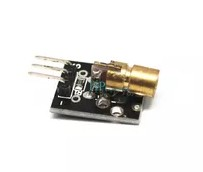
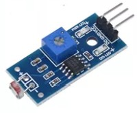
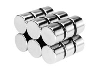

# What to use, where to buy

The following links provide an example. Find the cheapest yourself!

## Transmitter
The laser transmitters are [KY-008 650nm Laser sensor Module 6mm 5V 5mW Red Laser Dot Diode Copper Head KY008](https://www.aliexpress.com/item/4000693969769.html?spm=a2g0o.cart.0.0.43a738dam0hMLE&mp=1) as can found Aliexpress or a equivalent.

## Receptor
For the receivers a LDR prototype board is used: [Photoresistor (LDR) Sensor Module Detects Light Sensitive Photodiode for Arduino](https://www.aliexpress.com/item/32452315745.html) as can found Aliexpress or a equivalent.

## Magnets
The magnets to stick the receptors and transmittors to a metal object are [Circular Magnets sheet 15mm X 6mm Round Neodymium Magnet Strong N35 15x6mm Permanent Disc Magnet 15*6 mm](https://www.aliexpress.com/item/1005001581640011.html) as can be found on Aliexpress.

